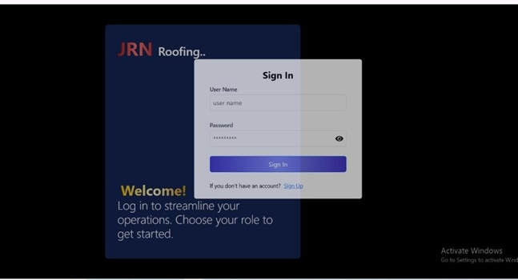

# JRN Billing and Inventory Management System

This is a **Billing and Inventory Management System** developed to help businesses manage sales, inventory, and user roles efficiently.

## 🔑 Features

- **🧾 Generate Invoice**  
  Triggered when a sale is processed by the cashier, automatically creating an invoice.

- **📦 Manage Inventory**  
  Add, update, and delete products. Monitor stock levels in real time.

- **📊 View Reports**  
  Access detailed financial reports based on sales data.

- **👥 Manage Users**  
  Add, update, or delete users, and assign roles (e.g., admin, cashier).

- **💰 Generate Financial Report**  
  Admins can generate financial reports using the latest sales data.

---

> ⚙️ Built with: Node.js · Express · MongoDB · React.js

